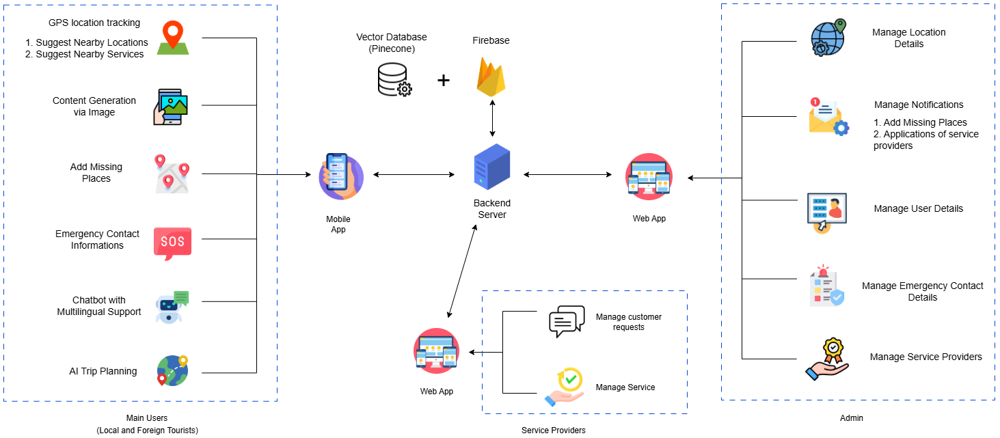
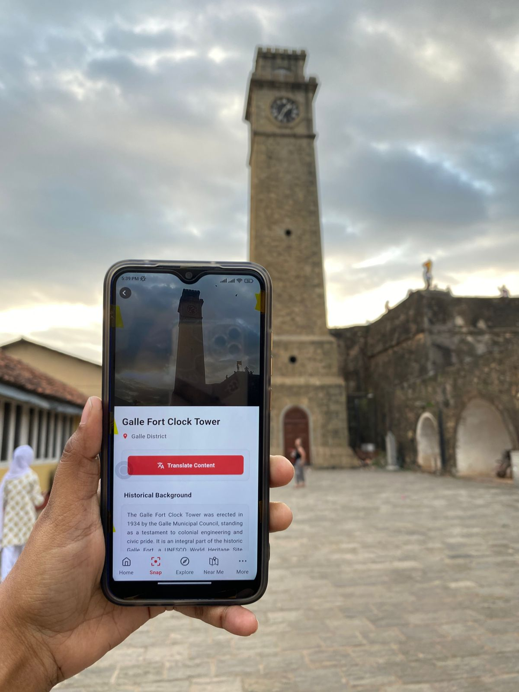
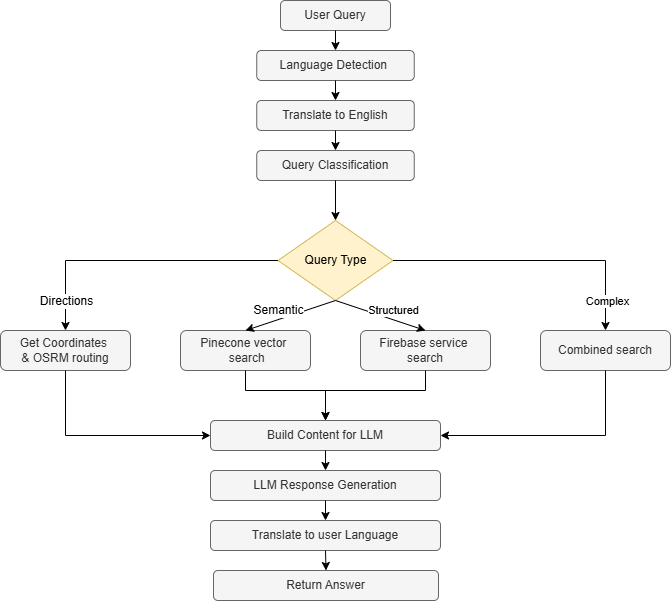
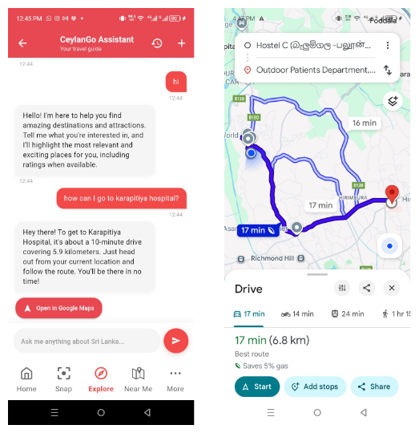
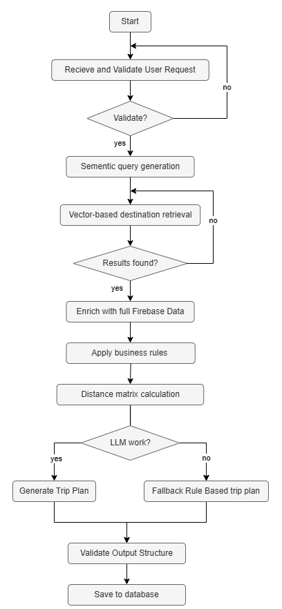
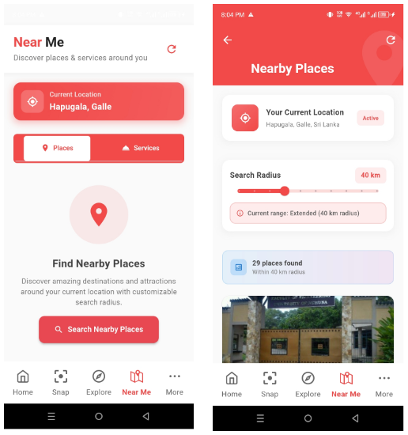

# AI-Aided Content Management System for Tourism Industry

AI-powered tourism platform designed to enhance the travel experience in **Sri Lanka** using **Generative AI, vector search, and location-aware services**.

The system integrates **mobile applications, web portals, and AI backend services** to provide intelligent tourism assistance including **content generation, multilingual communication, and personalized travel planning**.

---

## Table of Contents

- [Problem Statement](#problem-statement)
- [Proposed Solution](#proposed-solution)
- [System Architecture](#system-architecture)
- [AI Features](#ai-features)
- [Tech Stack](#tech-stack)
- [Project Demonstration](#demo)

---

# Problem Statement

Sri Lanka currently lacks a locally developed tourism platform that effectively utilizes modern technologies such as **Artificial Intelligence**.

Existing travel platforms often fail to highlight:

- Hidden attractions  
- Nearby services (night shops, events, vehical rentals etc)
- Historical and cultural locations  

Additionally, tourists frequently face **language barriers** when communicating with locals and struggle to access reliable travel information.

This project addresses these challenges by building an **AI-powered tourism platform** that provides intelligent recommendations, multilingual assistance, and automated tourism content generation.

---

# Proposed Solution

The platform provides an **AI-driven tourism assistance system** that helps tourists discover destinations and services, learn about locations, and plan trips efficiently.

### Key Features

- Image-based tourism content generation
- Multilingual AI chatbot
- Intelligent trip planning
- Location-aware recommendations
- Nearby services and emergency contacts

---

# System Architecture

The system follows a **Full-Stack AI Architecture** integrating mobile apps, web portals, and AI services.

### Tech Stack

- **Programming Languages** : Python | JavaScript | TypeScript
- **Backend**  : FastAPI 
- **Frontend** : Flutter | React.js
- **Databases** : Firebase(for Operational data) | Pinecone Vector Database (Semantic search)
- **AI**       : LLMs | RAG | Vector Embeddings | LangChain | Multimodal AI (Image + Text)
- **APIs**     : Google Gemini API | OSRM Routing Engine | Google map API
- **Infrastructure**  : Docker | AWS EC2

---

# AI Features

## 1. Image-Based Tourism Content Generation

This feature enables users to capture a image of a location and automatically generate rich, structured tourism friendly content including historical background, cultural insights etc by leveraging a **multimodal Retrieval-Augmented Generation (RAG) pipeline.**

---

### 🔹 Overview

The system integrates **computer vision, geospatial intelligence, and large language models (LLMs)** to identify Sri Lankan tourist destinations using **both image input and real-time GPS data.** It combines **vector similarity search, reverse geocoding, and contextual reasoning** to produce accurate and user-friendly outputs.

---

### 🔹 Pipeline

1. Image captured & location is tracked through mobile application
2. Image embeddings generated
3. Vector similarity search performed using Pinecone
4. Relevant location data retrieved
5. LLM generates structured tourism content

---

### 🔹 Key Highlights

- Multimodal AI pipeline (Vision + Location + Language)
- Conditional RAG architecture for improved accuracy
- Real-time geospatial filtering and contextual reasoning
- Scalable vector search with Pinecone
- Multilingual and voice-enabled user experience

---

## 2. Multilingual AI Chatbot

Provides intelligent tourism assistance in multiple languages, enabling users to ask questions about destinations, services, and travel guidance through a **context-aware Retrieval-Augmented Generation (RAG) system.**

---

### 🔹 Overview

The chatbot is designed to overcome language barriers for international travelers by integrating **multilingual processing, hybrid retrieval mechanisms, and LLM-based response generation.** It ensures accurate, relevant, and context-aware answers by combining **semantic search, structured queries, and geospatial reasoning.**

---

### 🔹 System Workflow

---

### 🔹 Key Highlights

- Multilingual conversational AI for tourism support
- Hybrid RAG architecture (semantic + structured + geospatial retrieval)
- Intelligent query routing for optimized performance
- Real-time navigation and route generation
- Context-aware, grounded LLM responses
- Persistent chat memory for improved user experience

---

## 3. Intelligent Trip Planning

Generates personalized, multi-day travel itineraries based on user preferences, leveraging a **hybrid AI architecture combining RAG, semantic search, and LLM orchestration.**

---

### 🔹 Overview

This feature creates **optimized travel plans** by analyzing user inputs (dates, interests, locations, and travel preferences) and combining them with **semantic destination retrieval, geospatial routing, and intelligent scheduling.** The system ensures both contextual relevance and real-world feasibility.

---

### 🔹 System Architecture & Workflow

---

### 🔹 Key Highlights

- Hybrid AI system (RAG + LLM + rule-based fallback)
- Personalized, preference-aware itinerary generation
- Geospatially optimized routing using OSRM
- Scalable vector search with Pinecone
- Robust validation and fault-tolerant design

---

## Location-Aware Recommendations

Provides real-time recommendations of **nearby tourist destinations and services using road-aware distance calculations and geospatial filtering.**

---

### 🔹 Overview

This feature enhances travel planning by replacing simple straight-line distance calculations with real-world routing intelligence, ensuring users receive accurate and practical nearby suggestions.

---

### 🔹 Key Highlights

- Real-world navigation accuracy (no Haversine approximation)
- Dynamic radius-based search customization
- Road-aware travel distance and time estimation
- Practical and user-centric recommendations

---

# Demo

Watch the full system demonstration here:  
[Click to view the demo](https://drive.google.com/file/d/1dw0WrWL8SdmHVUNNFSWjCkkc89zctQUc/view?usp=drive_link)

---

